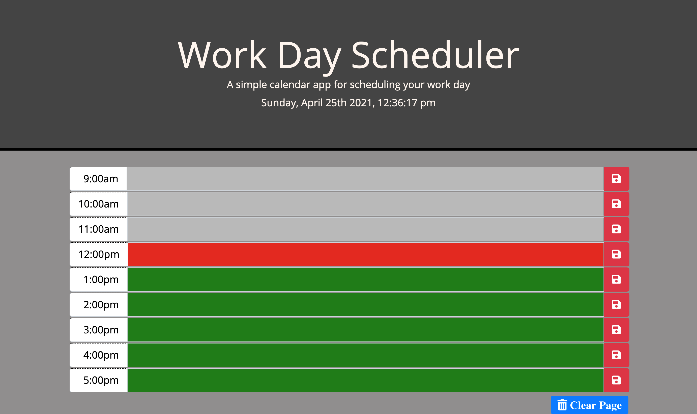

# zaks_day_planner

Discription:
Created a calendar application that allows the user to save events for each hour of their day. This app runs in the browser and features dynamically updated HTML and CSS powered by jQuery.

 

- added the missing links to the css and Js files accordingly 
- Studied all classes and IDs within Bootsrtap to implement and use in the HTML and JS files  
- Whiteboarded my plans while studying many tutorial videos and following along to use the code I couldnt think of myself  
- Researched how to add the current day using jQuery and added the simple line of code to pull from the local machines date/time and display in the header field 
- Built the timline rows in the main body, hardcoding them within the HTML file for jQuery to use 
- started by  

 

- Git Repo - https://github.com/theoneandonlyzako/zaks_coding-quiz 
- Direct link - https://theoneandonlyzako.github.io/zaks_coding-quiz/  

